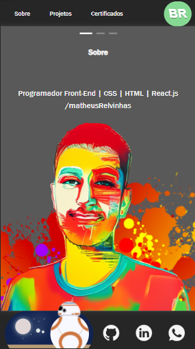

---

LINK PROJECT : https://matheusrelvinhas.github.io/portfolio-react/

  

Meu portfólio em react.js, nessa aplicação ultilizei context.Api para gerenciamento de todos estados sem precisar de passar props em cascata, todas funções e contantes de gerenciamento do estado estão app.js,
tem um checkbox para tema dark ou light e também para trocar idioma, português e inglês. Fiz import do componente Container e Card do ant.design agiliza bastante no codigo e deixa ele clean.
